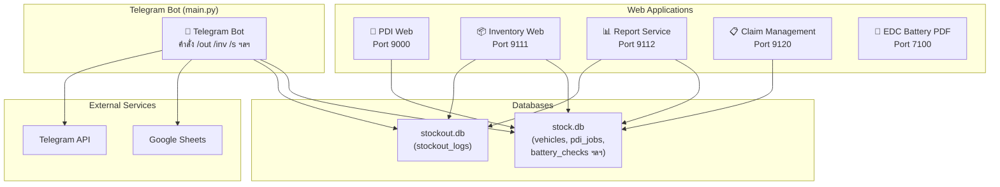
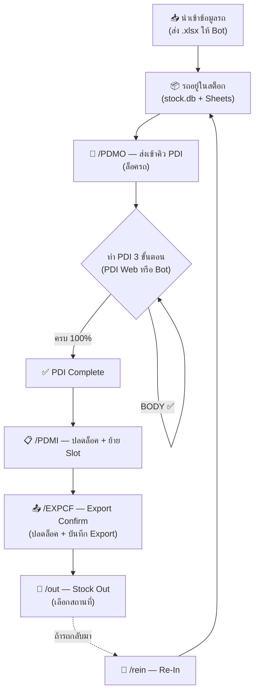
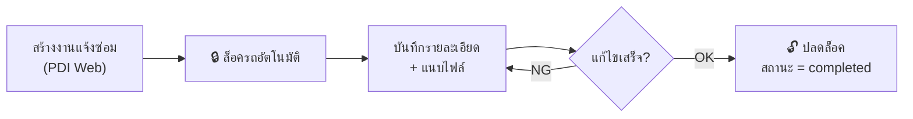

# 📘 คู่มือการใช้งานระบบ PDI System

---

## สารบัญ

1. [ภาพรวมระบบ](#1-ภาพรวมระบบ)
2. [การติดตั้งและตั้งค่า](#2-การติดตั้งและตั้งค่า)
3. [Telegram Bot — คำสั่งทั้งหมด](#3-telegram-bot--คำสั่งทั้งหมด)
4. [PDI Web — Port 9000](#4-pdi-web--port-9000)
5. [Inventory Web — Port 9111](#5-inventory-web--port-9111)
6. [Report Service — Port 9112](#6-report-service--port-9112)
7. [Claim Management — Port 9120](#7-claim-management--port-9120)
8. [EDC Battery PDF — Port 7100](#8-edc-battery-pdf--port-7100)
9. [ขั้นตอนการทำงาน (Workflow)](#9-ขั้นตอนการทำงาน-workflow)
10. [ตารางสรุป](#10-ตารางสรุป)

---

## 1. ภาพรวมระบบ

ระบบ PDI System เป็นระบบจัดการสต็อกรถยนต์แบบครบวงจร ประกอบด้วยโมดูลหลัก 6 ส่วน:



| โมดูล | ไฟล์ | พอร์ต | หน้าที่หลัก |
|-------|------|-------|------------|
| Telegram Bot | `main.py` | - | นำเข้า Excel, Stock Out/In, ค้นหา VIN, รายงาน |
| PDI Web | `pdi_web.py` | 9000 | คิว PDI, แจ้งซ่อม, แบตเตอรี่, VDCI Report |
| Inventory Web | `inventory_web.py` | 9111 | จัดการสต็อก, ย้าย Slot, ตรวจนับ |
| Report Service | `report.py` | 9112 | ออกรายงาน CSV/Preview พร้อมฟิลเตอร์ |
| Claim Management | `cm_web.py` | 9120 | จัดการ Claim, สร้าง PDFรายงาน |
| EDC Battery PDF | `EDC.py` | 7100 | สร้าง PDF รายงานแบตเตอรี่ UT675A |

---

## 2. การติดตั้งและตั้งค่า

### 2.1 ติดตั้ง Python Packages

```bash
pip install fastapi uvicorn python-telegram-bot pandas openpyxl gspread google-auth schedule flask fpdf reportlab pypdf Pillow xhtml2pdf Jinja2 python-multipart
```

### 2.2 ไฟล์ config.json

ไฟล์ตั้งค่าหลักของระบบอยู่ที่ `config.json`:

```json
{
  "db_path": "stock.db",               // ฐานข้อมูลหลัก (รถ, PDI, แบตเตอรี่ ฯลฯ)
  "pdi_db": "stock.db",                // ฐานข้อมูล PDI (ใช้ร่วมกับ db_path)
  "stockout_db_path": "stockout.db",   // ฐานข้อมูล Stock Out
  "telegram_bot_token": "TOKEN",       // Token ของ Telegram Bot
  "credentials_path": "credentials.json", // Google Service Account
  "google_sheet_url": "URL",           // URL ของ Google Sheets
  "worksheet_name": "StockIN",         // ชื่อ worksheet
  "poll_interval_minutes": 3,          // เวลาเช็คการเปลี่ยนแปลง Sheet (นาที)
  "notify_chat_id": "",                // Chat ID สำหรับแจ้งเตือน

  "pdi_web": { "host": "0.0.0.0", "port": 9000 },
  "inventory_web": { "host": "0.0.0.0", "port": 9111 },
  "stockout_web": { "host": "0.0.0.0", "port": 9112 },
  "longterm_web": { "host": "0.0.0.0", "port": 9119 }
}
```

### 2.3 ไฟล์ INVP.json (รหัสผ่าน)

ไฟล์เก็บ hash ของรหัสผ่าน (SHA-256) สำหรับ login เข้าเว็บทุกโมดูล:

```json
{
  "hashes": [
    "ค่า SHA-256 ของรหัสผ่าน"
  ]
}
```

### 2.4 การรันระบบ

```bash
# Telegram Bot
python main.py

# PDI Web (Port 9000)
python pdi_web.py
# หรือ
uvicorn pdi_web:app --host 0.0.0.0 --port 9000

# Inventory Web (Port 9111)
uvicorn inventory_web:app --host 0.0.0.0 --port 9111

# Report Service (Port 9112)
uvicorn report:app --host 0.0.0.0 --port 9112

# Claim Management (Port 9120)
python cm_web.py
# หรือ
uvicorn cm_web:app --host 0.0.0.0 --port 9120

# EDC Battery PDF (Port 7100)
python EDC.py
```

---

## 3. Telegram Bot — คำสั่งทั้งหมด

Bot ทำงานโดย `main.py` — เชื่อมต่อกับ Telegram API และ Google Sheets

### 3.1 `/start` — ดูคำสั่งทั้งหมด

พิมพ์ `/start` เพื่อดูรายการคำสั่งทั้งหมดที่ Bot รองรับ

---

### 3.2 📥 นำเข้าข้อมูลรถ (ส่งไฟล์ .xlsx)

**วิธีใช้:** ส่งไฟล์ `.xlsx` ให้ Bot โดยตรง

**เงื่อนไข:**
- ไฟล์ต้องเป็น `.xlsx`
- คอลัมน์ที่ต้องมี: `ID VAN.`, `Vin No.`, `Motor No.`, `Model`, `Exterior Color`, `Interior Color`, `Stock In`, `Ref On`
- รองรับชื่อคอลัมน์ภาษาอังกฤษหลายรูปแบบ

**สิ่งที่เกิดขึ้น:**
1. อ่านและแปลงข้อมูลจาก Excel
2. บันทึกเข้า SQLite (stock.db) — VIN ซ้ำจะ update, VIN ใหม่จะ insert
3. Sync ข้อมูลขึ้น Google Sheets
4. สร้าง ID VAN อัตโนมัติ (VAN000001, VAN000002, ...)
5. ส่ง **Excel สรุป** กลับให้ในแชท

---

### 3.3 📥 นำเข้า Stock Out (ส่งไฟล์ชื่อมี "stockout")

**วิธีใช้:** ส่งไฟล์ `.xlsx` ที่ชื่อไฟล์มีคำว่า `stockout`

**เงื่อนไข:**
- คอลัมน์ A = VIN หรือ ID VAN
- คอลัมน์ B = วันที่/เวลา
- คอลัมน์ C = ระบบจะประทับเวลาให้อัตโนมัติ
- (ถ้ามี) คอลัมน์ `Location` = สถานที่ออก

**สิ่งที่เกิดขึ้น:**
1. บันทึก Stock Out ลง stockout.db
2. ส่ง **ไฟล์ที่ประทับเวลาแล้ว** กลับ

---

### 3.4 `/s <เลขท้าย VIN>` — ค้นหา VIN

```
/s 05264
```

ค้นหารถจาก 4-5 หลักท้ายของ VIN แสดง:
- VIN เต็ม | Model | สีภายนอก | ID VAN

---

### 3.5 `/out <VIN หรือ ID VAN> [สถานที่]` — Stock Out

```
# แบบเลือกสถานที่จากปุ่ม
/out LSGH123456789

# แบบระบุสถานที่เลย
/out LSGH123456789 Silom
```

**การทำงาน:**
1. ตรวจสอบว่ารถถูก **ล็อค** อยู่หรือไม่ (PDI Lock, Damage Lock, Longterm Lock)
2. ถ้าไม่ระบุสถานที่ → แสดงปุ่ม Inline Keyboard ให้เลือกสถานที่
3. บันทึก Stock Out ลง stockout.db

**สถานที่ที่รองรับ:** Aion Yard, Bravo, Central Rama2, Emsphere, Ramintra, Kanchanapisek, Mahachai, Minburi, Pibulsongkram, Salaya, Sampeng, Silom, The Mall Bangkae, The Mall Bangkapi, Tip 5, Ubon, Vibpavadi, SaTon, Evme, บ้านลูกค้า, EV7, อู่ Taxi เจ้ประคอง, Fleet ตำรวจ, อยุธยา, Com7, Taxi lineman

> [!WARNING]
> ถ้ารถถูกล็อค (PDI/Damage/Longterm) จะ **ไม่สามารถ Out ได้** จนกว่าจะปลดล็อค

---

### 3.6 `/rein <VIN หรือ ID VAN>` — Stock In รอบ 2+ (Re-In)

```
/rein LSGH123456789
```

**สำหรับ:** รถที่เคย Out ไปแล้วแต่กลับเข้ามาใหม่

**การทำงาน:**
1. อัปเดต `stock_in` เป็นวันที่ปัจจุบัน
2. ตั้ง `slot = rein`
3. บันทึก Movement log
4. บันทึก `in_yard` ลง stockout.db

---

### 3.7 `/inv` — ส่ง Excel สรุปสต็อกคงเหลือ

```
/inv
```

ส่ง Excel กลับมาประกอบด้วย 3 Sheet:
- **Summary** — จำนวนรถคงเหลือทั้งหมด
- **ByModel** — จำนวนแยกตามรุ่น (Top 5)
- **Details** — รายละเอียดรถทุกคัน (VIN, ID VAN, Model, Color, Stock In, Ref On)

---

### 3.8 `/otoday` — รายงานรถออกวันนี้

```
/otoday
```

แสดงรถที่ออกวันนี้ (สูงสุด 20 รายการ) + ส่ง Excel ที่ประกอบด้วย:
- **Summary** — จำนวนทั้งหมด
- **ByModel** — แยกตามรุ่น
- **ByLocation** — แยกตามสถานที่
- **Details** — รายละเอียดทุกคัน

---

### 3.9 `/oto <DD-MM-YYYY> <DD-MM-YYYY>` — รายงานรถออกตามช่วงเวลา

```
/oto 01-10-2025 31-10-2025
```

เหมือน `/otoday` แต่ระบุช่วงเวลาเอง

---

### 3.10 `/PDMO <VIN หรือ ID VAN>` — ส่งเข้าคิว PDI (Lock)

```
/PDMO LSGH123456789
```

**การทำงาน:**
1. สร้าง PDI Job ใหม่ (หรือใช้ Job ที่มีอยู่)
2. **ล็อค** รถ — ไม่สามารถ `/out` ได้จนกว่าจะปลดล็อค
3. แสดงข้อมูลยืนยัน

---

### 3.11 `/PDMI <VIN หรือ ID VAN> <SLOT>` — ปลดล็อค PDI (Move-In)

```
/PDMI LSGH123456789 A-01
```

**เงื่อนไข:** PDI ต้อง **100% complete** แล้วเท่านั้น

**การทำงาน:**
1. ปลดล็อค (`is_locked = 0`)
2. อัปเดต Slot ใหม่

---

### 3.12 `/EXPCF <VIN หรือ ID VAN>` — Export Confirm

```
/EXPCF LSGH123456789
```

**การทำงาน:**
1. บันทึก Export Job (status: complete)
2. ปลดล็อค PDI
3. **ยังไม่** Stock Out อัตโนมัติ — ต้องใช้ `/out` แยก

---

### 3.13 `/STATUS <VIN หรือ ID VAN>` — เช็คสถานะรถ

```
/STATUS LSGH123456789
```

แสดงข้อมูล:
- 📍 Slot
- 🔹 Vehicle Status
- 🔹 PDI (สถานะ + %)
- 🔹 Export (สถานะ)
- 🔹 Lock (🔒 Locked / 🔓 Unlocked)

---

## 4. PDI Web — Port 9000

เข้าใช้งาน: `http://<server>:9000`

### 4.1 Login

เข้าระบบด้วยรหัสผ่านที่ hash ไว้ใน `INVP.json`

### 4.2 PDI Queue (หน้าหลัก)

| คอลัมน์ | คำอธิบาย |
|---------|---------|
| VIN | หมายเลข VIN |
| ID VAN | หมายเลข ID VAN |
| MODEL | รุ่นรถ |
| EXTERIOR | สีภายนอก |
| % | เปอร์เซ็นต์ PDI ที่เสร็จ |
| สถานะ | pending / in_progress / complete |
| เริ่ม (lock) | เวลาที่ล็อค |

- คิวจะ **อัปเดตอัตโนมัติ** แบบ real-time (SSE — Server-Sent Events)
- คลิก **"เปิด"** เพื่อเข้าไปจัดการแต่ละ Job

### 4.3 PDI Job Detail

แต่ละ Job มี 3 ขั้นตอน (PDI Steps):

| Step | ชื่อ | คำอธิบาย |
|------|-----|---------|
| FILL | เติมน้ำ/เติมลม/เช็คแบ็ต | ตรวจสอบน้ำ ลมยาง แบตเตอรี่ |
| VDCI | VDCI | ตรวจสอบ Diagnostic |
| BODY | ลอกลายตัวถัง | ลอกสติกเกอร์ป้องกัน |

- กดปุ่ม **OK** (สีเขียว) เมื่อผ่าน
- กดปุ่ม **NG** (สีแดง) เมื่อไม่ผ่าน
- เมื่อครบ 3 ขั้นตอน (100%) → สถานะเปลี่ยนเป็น `complete`

### 4.4 งานแจ้งซ่อม (Damage Reports)

เข้าจาก Tab **"งานแจ้งซ่อม"**

**สร้างงานใหม่:**
1. พิมพ์ VIN หรือ ID VAN
2. กดปุ่ม **"สร้าง"**
3. ระบบจะ **ล็อค** รถอัตโนมัติ (ไม่สามารถ Out ได้)

**จัดการงาน:**
- อธิบายความเสียหาย (description)
- แนบไฟล์ 2 ไฟล์
- ปุ่ม **Save** — บันทึกอย่างเดียว
- ปุ่ม **NG** — บันทึก + ล็อคไว้ (ยังไม่เสร็จ)
- ปุ่ม **OK** — แก้ไขเสร็จ + ปลดล็อค

**ตารางแสดง:**
- รายการที่ยังไม่เสร็จ (Pending)
- รายการที่เสร็จแล้ว (Completed) ล่าสุด 50 รายการ
- แสดง **ระยะเวลา** การแก้ไข

### 4.5 งานแบตเตอรี่ (Battery Check)

เข้าจาก Tab **"งานแบตเตอรี่"**

1. ค้นหา VIN / ID VAN
2. บันทึกข้อมูล:
   - **แบตเตอรี่ 12V**: สถานะ (OK/NG), หมายเหตุ, ไฟล์แนบ 2 ไฟล์
   - **แบตเตอรี่ High Voltage**: สถานะ (OK/NG), เปอร์เซ็นต์, หมายเหตุ, ไฟล์แนบ 2 ไฟล์

### 4.6 VDCI Report

เข้าจาก Tab **"Add Report VDCI"**

**อัปโหลดรีพอร์ต:**
1. ค้นหา VIN
2. อัปโหลดไฟล์ `.html` **2 ไฟล์** (ก่อนแก้ และ หลังแก้)
3. ระบบจะ **ตรวจสอบเวลา** จากไฟล์อัตโนมัติ เพื่อระบุว่าไฟล์ไหนคือ "ก่อน" และ "หลัง"
4. ระบบจะ **Parse DTC (Diagnostic Trouble Codes)** จากไฟล์อัตโนมัติ
5. **PDI จะถูก Mark เป็น 100% complete โดยอัตโนมัติ**

**เปรียบเทียบผล:**
- แสดง DTC ที่ **แก้ไขแล้ว** (Fixed — ขีดฆ่าสีแดง)
- แสดง DTC ที่ **ใหม่** (New — สีเขียว)
- แสดง DTC ที่ **ยังคงอยู่** (Remaining)

**จัดการรูปภาพ:**
- อัปโหลดรูปภาพประกอบ (สูงสุด 20 รูป)
- รองรับ Drag & Drop
- สามารถลบรูปได้

### 4.7 Batch Upload VDCI

เข้าจาก Tab **"Batch Upload VDCI"**

- เลือก **โฟลเดอร์** ที่มีไฟล์ `.html` ทั้งหมด
- ระบบจะ:
  1. อ่าน VIN จากแต่ละไฟล์
  2. จับคู่ไฟล์ "ก่อน" กับ "หลัง" โดยอัตโนมัติ (ตาม VIN และเวลา)
  3. ถ้ามีไฟล์เดียวต่อ VIN → ใช้เป็น "หลังแก้"
  4. Mark PDI เป็น 100% complete ให้ทุก VIN ที่ประมวลผลสำเร็จ

---

## 5. Inventory Web — Port 9111

เข้าใช้งาน: `http://<server>:9111`

### 5.1 Login

เข้าระบบด้วยรหัสผ่านเดียวกับ PDI Web (hash ใน `INVP.json`)

### 5.2 หน้า INVENTORY (หน้าหลัก)

**ค้นหารถ:**
- พิมพ์ VIN หรือ ID VAN (2 ตัวขึ้นไป) → แสดงรายการ Dropdown อัตโนมัติ
- คลิกเลือกรถเพื่อเข้าหน้ารายละเอียด

**หน้ารายละเอียดรถ** แสดง:
- ข้อมูลพื้นฐาน (VIN, ID VAN, Model, สี, Stock In, Ref On)
- 📍 Slot ปัจจุบัน + ปุ่มอัปเดต Slot
- สถานะ PDI (%, สถานะ)
- สถานะ Export
- สถานะ Lock (PDI Lock, Damage Lock, Longterm Lock)
- สถานะ Out Yard
- ข้อมูลแบตเตอรี่ล่าสุด
- ข้อมูล VDCI Report ล่าสุด
- ข้อมูลจดทะเบียน (เลขทะเบียน, วันหมดภาษี)
- ประเภทรถ
- ข้อมูลเตรียมส่งมอบ (พ่นข้าง, พ่นทะเบียน, สติกเกอร์, อุปกรณ์ Taxi)
- สถานะ Longterm Maintenance

**จัดการ Slot:**
- ป้อน Slot ใหม่ → กด Update
- ระบบจะบันทึก Movement log (from_slot → to_slot)

**ยืนยัน/ยกเลิก In-Stock:**
- ปุ่ม **ยืนยันอยู่ในสต็อก** → ตั้ง `in_stock = 1`
- ปุ่ม **ยกเลิก** → ตั้ง `in_stock = 0`

### 5.3 ตรวจนับสต็อก (Count System)

เข้าจาก Tab **"ตรวจนับสต็อก"**

**สร้าง Job ตรวจนับ:**
1. กดปุ่ม **"เริ่มตรวจนับรอบใหม่"**
2. สแกนหรือพิมพ์ VIN ทีละคัน
3. แต่ละ VIN จะบันทึก: VIN, ID VAN, Model, Slot ใหม่, เวลา

**จุดเด่น:**
- ป้องกัน VIN ซ้ำในรอบเดียวกัน
- เมื่อสแกน VIN → สามารถอัปเดต Slot ใหม่ + บันทึก stock-in log พร้อมกัน
- สามารถปิด Job เมื่อเสร็จ

---

## 6. Report Service — Port 9112

เข้าใช้งาน: `http://<server>:9112`

### 6.1 Login

เข้าระบบด้วยรหัสผ่าน (hash ใน `INVP.json`)

### 6.2 Export Inventory

ออกรายงาน CSV หรือ Preview ตารางกรองรถทั้งหมดด้วยฟิลเตอร์ 8 ตัว:

| ฟิลเตอร์ | ตัวเลือก | คำอธิบาย |
|----------|---------|---------|
| **Filter 1: Slot** | N/A / มีSlot / ไม่มีSlot | กรองรถที่มี/ไม่มี Slot |
| **Filter 2: PDI** | N/A / PDI100% / ยังไม่PDI | กรองตามสถานะ PDI |
| **Filter 3: Export** | N/A / Export100% / ยังไม่Export | กรองตามสถานะ Export |
| **Filter 4: Inventory** | N/A / InStock / NotInStock | กรองตาม In-Stock |
| **Filter 5: Out_yard** | N/A / Out_yard / ยังไม่Out_yard | กรองรถที่ออก/ยังไม่ออก |
| **Filter 6: Rein** | N/A / rein / ไม่rein | กรองรถที่ Re-In |
| **Filter 7: Location** | N/A / สถานที่ต่างๆ | กรองตามปลายทาง |
| **Day yard** | ทั้งหมด / >30วัน / >60วัน / >90วัน | กรองรถที่อยู่นานเกิน X วัน |

**คอลัมน์ที่ Export:**
Vin No., Motor No., Model, Ext Color, Int Color, Stock In, Day yard, Rein, Slot, Out At, Location, แบต 12V, แบต Hivol, ตรวจสอบแบตล่าสุด, DTCs Before, DTCs After, Filter1-6, เลขทะเบียน, วันหมดภาษี, ประเภทรถ, พ่นข้าง, พ่นทะเบียน, สติกเกอร์, รายละเอียดสติกเกอร์, อุปกรณ์ Taxi, VDCI, Longterm รอบล่าสุด

**ปุ่ม:**
- **Export** → ดาวน์โหลดเป็น CSV
- **Preview** → แสดงตารางบนหน้าเว็บ

### 6.3 Export Damage Report

ออกรายงานงานแจ้งซ่อมทั้งหมด (ดูรายงาน Damage Report แยก)

---

## 7. Claim Management — Port 9120

เข้าใช้งาน: `http://<server>:9120`

### 7.1 PDI Search (หน้าหลัก)

ค้นหา VIN เพื่อดูข้อมูลรถและจัดการ Claim

### 7.2 PDI Detail Page

เมื่อเลือกรถ จะแสดง:
- ข้อมูลรถ (VIN, Model, สี ฯลฯ)
- ข้อมูล VDCI Report ล่าสุด
- ข้อมูล Battery Check ล่าสุด

### 7.3 Battery Check (Claim)

**บันทึกข้อมูลแบตเตอรี่:**
- Voltage, Battery Health, Charge Status (SOC), CCA Value
- อัปโหลดรูปภาพ

**จัดการ:**
- แก้ไขข้อมูลที่บันทึกไว้
- ลบข้อมูลเก่า

### 7.4 สร้าง PDF รายงาน Claim

ระบบสร้าง PDF อัตโนมัติโดยรวม:
1. **Template PDF** จากโฟลเดอร์ `PDFC/` (เช่น ฟอร์ม Claim ตามรุ่นรถ)
2. **ข้อมูล Overlay** (VIN, วันที่, ข้อมูลแบตเตอรี่) — วางทับบน PDF Template ตามพิกัดใน `pdf_coords.json`
3. **PDPA Form** (PDPA1.pdf, PDPA2.pdf)
4. **รูปแบตเตอรี่** แปลงเป็น PDF หน้าเพิ่ม
5. **VDCI Report** (HTML → PDF)

### 7.5 ตั้งค่าพิกัด PDF

เข้าจาก `/config/pdf`:
- ดู/แก้ไข PDF Template ที่มี
- ตั้งค่าพิกัด (x, y, size, color) สำหรับแต่ละ field ที่จะ overlay บน PDF

---

## 8. EDC Battery PDF — Port 7100

เข้าใช้งาน: `http://<server>:7100`

ระบบสร้าง PDF รายงานผลตรวจแบตเตอรี่ **UT675A** แบบเรียบง่าย (Flask)

### 8.1 ตั้งค่า Template

ปรับค่าต่างๆ:
- ขอบซ้าย, ความกว้างชื่อ, ระยะห่างบรรทัด, ฟอนต์เนื้อหา
- กด **"💾 บันทึกเทมเพลต"** เพื่อบันทึก (เซฟลง `battery_template_config.json`)

### 8.2 SINGLE — สร้าง PDF ใบเดียว

1. เลือกรุ่น: **370A (YP)** หรือ **420A (ES)**
2. เลือกวันที่/เวลา
3. กด **"📄 ออก PDF"**
4. ระบบจะ **สุ่มค่า** SOC, Voltage, SOH, Measured, Internal R ตามแต่ละรุ่น

### 8.3 BATCH — นำเข้า Excel

1. เลือกไฟล์ Excel:
   - คอลัมน์ A = VIN
   - คอลัมน์ B = วันที่/เวลา
   - คอลัมน์ D = รุ่น (YP/ES)
2. ระบบจะ **สุ่มเพิ่มเวลา 3-7 นาที** ให้แต่ละแถว
3. ดาวน์โหลดเป็น **ZIP** ที่มี PDF ทุกคัน

---

## 9. ขั้นตอนการทำงาน (Workflow)

### 🚗 Workflow หลัก: รถเข้า → PDI → ส่งออก



### 🔧 Workflow: งานแจ้งซ่อม



### 📊 Workflow: VDCI Report


---

## 10. ตารางสรุป

### พอร์ตทั้งหมด

| พอร์ต | โมดูล | ไฟล์ |
|-------|-------|------|
| 7100 | EDC Battery PDF (Flask) | `EDC.py` |
| 9000 | PDI Web (FastAPI) | `pdi_web.py` |
| 9111 | Inventory Web (FastAPI) | `inventory_web.py` |
| 9112 | Report Service (FastAPI) | `report.py` |
| 9119 | Longterm Web | (ไฟล์แยก) |
| 9120 | Claim Management (FastAPI) | `cm_web.py` |

### ฐานข้อมูล

| ฐานข้อมูล | ตาราง/ข้อมูลหลัก |
|-----------|-----------------|
| **stock.db** | `vehicles` (ข้อมูลรถ), `pdi_jobs` (งาน PDI), `pdi_steps` (ขั้นตอน PDI), `pdi_results` (ผล PDI), `pdi_locks` (ล็อค PDI), `damage_reports` (งานแจ้งซ่อม), `damage_logs` (ล็อกแจ้งซ่อม), `battery_checks` (ตรวจแบตเตอรี่), `vdci_report_pairs` (VDCI Report), `vdci_report_images` (รูป VDCI), `export_jobs` (Export), `import_logs` (ล็อกนำเข้า), `inventory` (ยืนยันสต็อก), `movements` (ล็อกเคลื่อนย้าย), `inventory_count_jobs` (ตรวจนับ), `inventory_count_items` (รายการตรวจนับ), `vehicle_registration` (จดทะเบียน), `vehicle_type` (ประเภทรถ), `delivery_prep` (เตรียมส่งมอบ), `claim_battery_checks` (Claim แบตเตอรี่), `longterm_jobs` (Longterm) |
| **stockout.db** | `stock_outs` (ข้อมูล Stock Out), `stockout_logs` (ล็อก Stock Out พร้อมตำแหน่ง) |

### ไฟล์สำคัญ

| ไฟล์ | หน้าที่ |
|------|--------|
| `config.json` | ตั้งค่าหลักของระบบ (DB, Bot Token, Ports) |
| `INVP.json` | hash รหัสผ่าน สำหรับ login เว็บทุกโมดูล |
| `credentials.json` | Google Service Account สำหรับเชื่อม Google Sheets |
| `battery_template_config.json` | ตั้งค่า Template PDF แบตเตอรี่ (EDC) |
| `pdf_coords.json` | พิกัดสำหรับ overlay ข้อมูลบน PDF (Claim) |
| `sheet_snapshot.json` | เก็บ hash ล่าสุดของ Google Sheet (ตรวจการเปลี่ยนแปลง) |

### โฟลเดอร์

| โฟลเดอร์ | หน้าที่ |
|----------|--------|
| `uploads/` | ไฟล์ที่อัปโหลดผ่าน Bot (Excel) |
| `uploads_damage/` | ไฟล์แนบ Damage Report, VDCI Report, Battery Check |
| `uploads_claim/` | รูปแบตเตอรี่ Claim |
| `exports/` | ไฟล์ที่ Export ออก (Excel) |
| `PDFC/` | PDF Template สำหรับ Claim |
| `templatesx/` | HTML Templates สำหรับ Claim Web |
| `static/` | Static files |
